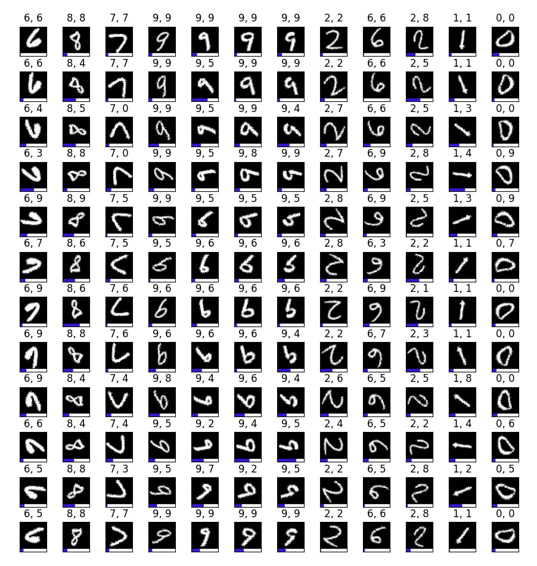

[](https://github.com/yliess86/BayeTorch/blob/master/LICENSE)
[](https://www.python.org/downloads/release/python-360/)
[](https://pytorch.org/)

# BayeTorch: *Towards Democratized Bayesian Deep Learning with PyTorch*

BayeTorch is an experimental module for **Python** based on the **PyTorch** library. It aims at profiding a simple way to turn any -- at least the one with the layers currently supported -- PyTorch model into its **Bayesian** equivalent using a **Bayesian by Backpropagation** approach. **Layers** from the PyTorch library are ported to their Bayesian form -- `Bayesian[ModuleName]` -- using the local reparametrization trick. Some commonly used **Criterions** are also available such as the **ELBO**, minimized for classification tasks, and the **Uncertainty** offering **epistemic** and **aleatoric** estimations.

*This work is one implementation of [Shridhar et al. 2019] work.*

**Supported Layers**:

|PyTorch Names    |BayeTorch Equivalent             |
|:----------------|:--------------------------------|
|torch.nn.*Linear*|bayetorch.layers.*BayesianLinear*|
|torch.nn.*Conv1d*|bayetorch.layers.*BayesianConv1D*|
|torch.nn.*Conv2d*|bayetorch.layers.*BayesianConv2D*|
|torch.nn.*Conv3d*|bayetorch.layers.*BayesianConv3D*|

**Model Zoo**:

|Model Name|Frequentist Equivalent   |BayeTorch Equivalent             |
|:---------|:------------------------|:--------------------------------|
|*LeNet5*  |bayetorch.models.*LeNet5*|bayetorch.models.*BayesianLeNet5*|
|*VGG11*   |bayetorch.models.*VGG11* |bayetorch.models.*BayesianVGG11* |
|*VGG13*   |bayetorch.models.*VGG13* |bayetorch.models.*BayesianVGG13* |
|*VGG16*   |bayetorch.models.*VGG16* |bayetorch.models.*BayesianVGG16* |
|*VGG19*   |bayetorch.models.*VGG19* |bayetorch.models.*BayesianVGG19* |

**Metrics**:

|Metric Name  |BayeTorch Equivalent           |
|:------------|:------------------------------|
|*ELBO*       |bayetorch.metrics.*ELBO*       |
|*Uncertainty*|bayetorch.metrics.*Uncertainty*|


## Install

### System Install

The BayeTorch module can be installed using the following command (may require sudo):

```bash
$ (sudo) python3 setup.py install
```

### Local usage

If you want to use the BayeTorch module without installation, you need at least to install all the modules required for its use (may require sudo):

```bash
$ (sudo) pip3 install -r requirements.txt
```

### Tests

All the test can run using the PyTest module installed with the requirements:

```bash
$ pytest -v .
```

If your computer/machine is not able to run all the test due to memory consumption, you can run them individually with the same command specifying the test you want to run.

```bash
$ pytest -v tests/[TestFile].py
```

### Benchmarks

Benchmarks are available via the `benchmarks` folder ans can be run with (requires cuda enable GPU with cuda and cudnn installed):

#### Frequentists vs Bayesian

```bash
$ python3 -m benchmarks [-h] --model MODEL --epochs EPOCHS [EPOCHS ...]\
    --batch_size BATCH_SIZE [--n_workers N_WORKERS] --lr LR [LR ...]\
    [--samples SAMPLES] --task TASK [--freeze]
```

* **Task**: acc, init, uncert
* **Epochs**: give 1 for acc and uncert, 2 for init
* **Lr**: give 2 for acc and init, 1 for uncert

**Benchmarks available** *(Accurcy reported from validation)*
|Model |Name |Dataset|Frequentist Accuracy|Bayesian Accuracy|Frequentist Size|Bayesian Size|
|:-----|:----|:------|-------------------:|----------------:|---------------:|------------:|
|LeNet5|LeNet|MNIST  |              98.75%|           98.43%|         338.9kB|      676.1kB|
|VGG11 |VGG11|CIFAR10|              82.99%|           63.96%|         72.39Mb|      144.8Mb|
|VGG16 |VGG16|CIFAR10|              86.56%|           75.81%|         114.3Mb|      228.6Mb|

|Model |Name |Dataset|Epochs|Learning Rate*|Batch Size|
|:-----|:----|:------|-----:|-------------:|---------:|
|LeNet5|LeNet|MNIST  |    10|     1e-2/1e-3|       256|
|VGG11 |VGG11|CIFAR10|    50|     1e-3/1e-4|       256|
|VGG16 |VGG16|CIFAR10|   100|     1e-3/1e-4|       256|

\* Learning rate is different for frequentist and bayesian `f_lr/b_lr`. Bayesian version seems to work better with smaller learning rates.

> ##### Disclaimer
> No efforts have been put in achieving best performances on the tasks presented in this benchmark.
> This benchmark is present to offer a basic overview comparing frequentist to bayesian version of common models.
> Obviously one could tune the models using Hyperparameter Scheduling, Dropout, Batch Normalization, 
> Regularization, ... etc, to improve the performances.

#### Bayesian with Pretrained Frequentist

This benchmark shows if their is any benefit benefit from preinitializing a bayesian model with its pretrained frequentist counterpart.

|Model |Name |Dataset|Pretrained Accuracy|Starting Accuracy|Final Accuracy|Freezed|
|:-----|:----|:------|------------------:|----------------:|-------------:|:------|
|LeNet5|LeNet|MNIST  |             98.40%|           86.09%|        98.97%|False  |
|LeNet5|LeNet|MNIST  |             98.40%|           55.42%|        63.09%|True   |
|VGG11 |VGG11|CIFAR10|             74.18%|           10.00%|        10.00%|False  |
|VGG11 |VGG11|CIFAR10|             74.18%|           10.00%|        69.50%|True   |
|VGG16 |VGG16|CIFAR10|             76.04%|           10.00%|        10.00%|False  |
|VGG16 |VGG16|CIFAR10|             76.04%|           10.00%|        65.16%|True   |

|Model |Name |Dataset|Epochs|Learning Rate|Batch Size|Freezed|
|:-----|:----|:------|-----:|------------:|---------:|:------|
|LeNet5|LeNet|MNIST  |     3|         1e-3|       256|False  |
|LeNet5|LeNet|MNIST  |     3|         1e-3|       256|True   |
|VGG11 |VGG11|CIFAR10|    50|         1e-4|       256|False  |
|VGG11 |VGG11|CIFAR10|    50|         1e-4|       256|True   |
|VGG16 |VGG16|CIFAR10|   100|         1e-4|       256|False  |
|VGG16 |VGG16|CIFAR10|   100|         1e-4|       256|True   |

* **Pretrained** descirbe the pretrained Frequentists model
* **Starting** descirbe the Bayesian model initialized with the Pretrained model without before training
* **Final** descirbe the Bayesian model initialized with the Pretrained model without after training
* **Freeze** describe if the pretrained weights are frozen or not

#### Uncertainty

Both **Epsitemic** and **Aleatoric** uncertainty can be retrieved through the use of the **Uncertainty** metric. The implementation followes the original implementatio ndescribe in the paper from [Shridhar et al. 2019]. As the following figure shows, the epsitemic uncertainty seems to increase when the picture are rotated and the model gets the prediction wrong. The figure show MNIST images rotated from 0 to 360 degrees with their assiociated epistemic uncertainty in blue (rescaled by a factor of 100) with a sample size of 15 and `BaysianLeNet5`. Label and model predictions are shown above the corresonding image in the form `label, prediction`.



Concerning the aleatoric uncertainty, its value only seems to change when modifying the dataset or the augmentation pipleine.

## References

- [Shridhar et al. 2019]: Uncertainty Estimations by Softplus normalization in
Bayesian Convolutional Neural Networks with
Variational Inference ([Github](https://github.com/kumar-shridhar/PyTorch-BayesianCNN))

[Shridhar et al. 2019]: https://arxiv.org/pdf/1806.05978.pdf